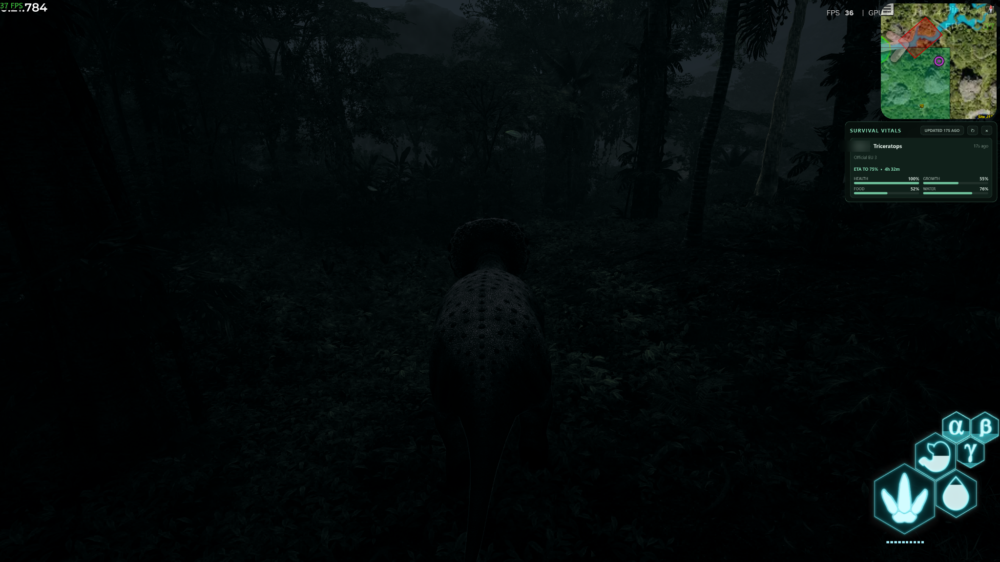
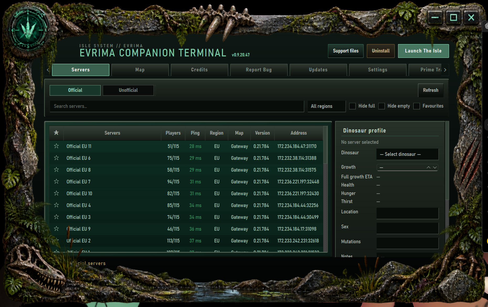
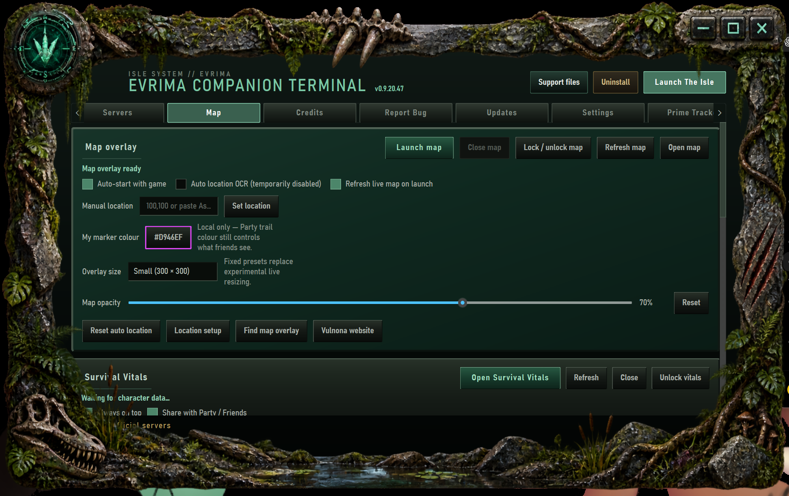

# Evrima Companion

**Unofficial Windows companion app for The Isle: Evrima — server browser, live map tools, Survival Vitals, Prime Tracker, growth ETA, Party/Friends and Second Screen.**

**[Download the public tester](https://github.com/PwNz-Noobinator/evrima-companion/releases/tag/v0.9.20.40)** · **[Changelog](CHANGELOG.md)** · **[Tester guide](TESTER_BUILD.md)** · **[Support](SUPPORT.md)** · **[Privacy](PRIVACY.md)**

---

Evrima Companion is an unofficial Windows utility built specifically for **The Isle: Evrima**. It combines an Evrima server browser, dinosaur profiles, live map-location tools, **Survival Vitals**, **Prime Tracker**, growth ETA estimates, Party/Friends tracking and a phone/tablet **Second Screen** in one application.

If you are looking for a **The Isle Evrima companion app**, **Evrima map companion**, **Evrima growth tracker**, **Prime Tracker**, **Survival Vitals HUD**, **dinosaur growth ETA**, **Party location tracker** or **Second Screen map**, those functions are part of the same Companion rather than separate tools.

**Current public GitHub tester/bootstrap: v0.9.20.40.** Installed testers receive normal application updates through the **Supabase Stable** channel, so the large GitHub bootstrap ZIP does not need to be rebuilt for every application update.

> [!IMPORTANT]
> **Current Stable: v0.9.20.47.** The GitHub download is the v0.9.20.40 bootstrap. After Companion opens for the first time, go to **Updates → Check for updates** and install the newest Stable version before testing or using Companion.

## Screenshots

### In-game overlays

*Desktop map overlay and Survival Vitals running alongside The Isle: Evrima, including live growth data and Prime ETA.*

### Server browser & dinosaur profile

*Official server browser with live player/ping information and the saved dinosaur profile panel.*

### Map controls

*Desktop map controls, manual location tools, overlay size/opacity settings and Survival Vitals controls.*

## What Evrima Companion does

| Feature | What it does |
|---|---|
| **Evrima Server Browser** | Browse Official and Unofficial servers with search, filters, favourites, ping and player counts. |
| **Dinosaur Profiles** | Save dinosaur, growth, location, sex, mutations and notes per server, with Prime full-growth ETA when available. |
| **Live Map Tools** | Desktop Vulnona map overlay, automatic live Asset Location updates, manual coordinates, waypoints, opacity and size controls. |
| **Party / Friends** | Share live positions, trails, markers and selected Survival Vitals with your group. |
| **Survival Vitals HUD** | Health, Growth, Food and Water with automatic active-character detection and optional Prime ETA. |
| **Prime Tracker** | Track Sanctuary, Migration, Mass Migration and Patrol visits plus observed growth-rate ETA. |
| **Second Screen** | Use a phone or tablet as a live Companion map over your local Wi-Fi/LAN. |
| **Bug Report Threads** | Built-in private bug reports, acknowledgements, developer replies and tester follow-ups. |
| **Optional Telemetry** | Opt-in, inspectable compatibility and content-free feature-use telemetry. |
| **Languages & Appearance** | Multiple interface languages and configurable UI accent colour. |

### Current Stable highlights — v0.9.20.47

Recent Stable releases added and hardened:

- **Prime Tracker** with automatic Sanctuary, Migration, Mass Migration and Patrol-zone visit detection.
- Prime movement-segment checks with tolerance for circle, polygon and open-path zone geometry.
- Observed growth-rate estimates with **ETA to 75% first**, then **ETA to 100%** after reaching 75% growth in Survival Vitals/Party displays.
- Direct live Asset Location → Prime Tracker handoff so Prime does not depend on OCR.
- Survival Vitals lifecycle handling so dead/departed dinosaurs do not retain stale Growth/Prime ETA.
- Desktop map lifecycle improvements so the map can remain open after The Isle exits.
- Startup notifications for normal Stable updates, with a **Not now** path for non-forced releases.
- Persistent telemetry consent and privacy-minimised feature-use events.
- Locked resolved/closed bug-report threads.
- Better Party disconnect-state handling.
- Expanded bug-report diagnostics for **Survival Vitals** and **Prime Tracker**.
- OCR recovery work retained internally, while **OCR is currently disabled and locked off** because Companion now has working non-OCR location paths.

See the [public testing changelog](CHANGELOG.md) for version-by-version details.

## Feature guides

- [Prime Tracker — zones, growth tracking and ETA](docs/PRIME_TRACKER.md)
- [Survival Vitals — Health, Growth, Food, Water and Prime ETA](docs/SURVIVAL_VITALS.md)
- [Live Map & Location Tools — Gateway map, Asset Location and waypoints](docs/MAP.md)
- [Party / Friends — shared locations, trails and vitals](docs/PARTY.md)
- [Second Screen — phone/tablet map over local Wi-Fi/LAN](docs/SECOND_SCREEN.md)
- [Frequently Asked Questions](docs/FAQ.md)

---

## Download & install

**[Download Evrima Companion v0.9.20.40 — Public Tester](https://github.com/PwNz-Noobinator/evrima-companion/releases/tag/v0.9.20.40)**

The GitHub tester package is the **initial installation route**. Once Companion is installed, routine updates are delivered through the **Supabase Stable update channel**.

1. Download **`Evrima-Companion-v0.9.20.40-Public-Tester.zip`** from the release Assets.
2. **Before extracting it**, right-click the downloaded ZIP → **Properties**. If Windows shows **Unblock**, tick it and click **Apply**.
3. Extract the entire ZIP to a normal folder.
4. Double-click **`BUILD AND INSTALL EVRIMA COMPANION.cmd`**.
5. Wait while the normal Companion executable is built locally and the install process starts automatically.
6. When Companion opens, go to **Updates → Check for updates** and install the newest Stable version.

> [!IMPORTANT]
> **Do not assume the version in the GitHub ZIP is the newest version.** GitHub provides the bootstrap installer; normal Companion releases are delivered through the built-in Stable updater.

**Python is not required.** The tester package includes its own private build runtime.

### Requirements

- **64-bit Windows**.
- **The Isle: Evrima** for game-linked features.
- A local network connection for **Second Screen** on a phone or tablet.
- No separate Python installation is required.

---

## Features

### Evrima server browser & dinosaur profiles

- Browse **Official** and **Unofficial** Evrima servers.
- Search by server name and filter by region, full/empty servers and favourites.
- See player count, ping, region, map and server version.
- Save a dinosaur profile for each server, including dinosaur, growth, location, sex, mutations and notes.
- Where Evrima provides the data, Companion can read the current dinosaur's **growth, health, hunger and thirst** from the game's local character data.
- Dinosaur Profiles can show Prime **full-growth ETA** when Prime Tracker is enabled and enough growth samples exist.
- Launch The Isle from Companion.

### Live map & location tools

- Integrated **Vulnona Map Overlay** for the desktop.
- Companion can use the live Asset Location path to update the map without relying on OCR.
- Manual coordinates remain available as a fallback.
- Lock/unlock the map, choose its size and adjust opacity.
- Optionally open the map automatically with The Isle.
- The desktop map can remain open after The Isle exits.
- Save, edit, delete and copy waypoints.
- Choose your own local marker colour.

**OCR is currently disabled and locked off in Stable.** Its recovery implementation remains in development, but current location and Prime functionality uses the non-OCR live path.

### Survival Vitals HUD

Survival Vitals is a compact HUD that follows the character you are currently playing.

- Shows **Health, Growth, Food and Water** without requiring OCR.
- Automatically follows the active dinosaur/server from Evrima's local character data.
- Works solo or with Party/Friends shared vitals.
- With Prime Tracker enabled, ETA shows **time to 75% growth while below 75%**, then automatically switches to **full-growth ETA** after 75%.
- Lock it to make it fixed and mouse click-through while playing.
- Unlock it to move or resize it.
- Remembers position, size and lock state.
- Includes manual **Refresh** and **Close** controls.
- Failed/partial character-data reads are retried automatically.
- Dead/departed dinosaurs no longer retain stale Growth or Prime ETA as the active character.

### Prime Tracker

Prime Tracker uses the same live Gateway coordinates used by the map rather than creating a second location system.

- Tracks unique **Sanctuary**, **Migration**, **Mass Migration** and **Patrol Zone** visits for the current dinosaur life.
- A zone does not need to be active at the moment of the visit; Companion tracks known places where that zone can occur.
- Checks the movement segment between consecutive location samples so a crossed zone can still be detected between readings.
- Uses tolerant geometry for circles, closed polygons and open/path-style zones rather than relying on one narrow hitbox model.
- Keeps per-life progress across normal restarts and provides a manual **Reset current Prime run** fallback.
- Keeps conditions that cannot be inferred from available local data as explicit manual objectives.
- Measures observed growth change over time and estimates ETA to **75%** and **100%** growth.
- Shows brief click-through progress notifications when automatic objectives are detected.
- Refreshes Prime zone geometry from VulnonaMAP when available and falls back to a bundled Gateway snapshot if live refresh is unavailable.

Prime rules are game/community data and may change with game patches; the game remains authoritative.

### Party / Friends

Create a Party code and give it to your friends, or join somebody else's Party.

- See Party members' live map locations.
- See separate trails for each player.
- Choose display name, trail colour and marker symbol.
- Control how much location history is shown.
- Turn your own location sharing on or off.
- Party markers work on both the desktop map and Second Screen.
- Party members can optionally share dinosaur, server, Health, Growth, Food and Water.
- Prime ETA can be carried with shared vitals when enabled and available.
- Dropped Party connections clear the connected state rather than leaving a stale connected indicator.

### Second Screen phone/tablet map

- Start the phone map from Companion and connect using the displayed **QR code**.
- Runs over your **local Wi-Fi/LAN**.
- Works while the desktop overlay is open or independently of it.
- Receives your latest map position and displays Party/Friend markers and trails.

### Bug reports & replies

The built-in bug reporter uses private project reports rather than requiring testers to post diagnostics publicly.

- Every successful submission gets a `BUG-XXXXXXXX` reference.
- New reports receive an automatic acknowledgement.
- **My reports & replies** shows report status and its conversation.
- Developers can reply to the exact report and testers can answer in the same thread.
- Each report has a private random local reply key; the backend stores only its hash.
- Once a report is **resolved** or **closed**, tester reply controls are disabled and the backend rejects further tester replies.
- Diagnostic snapshots can include technical state from the map, Party, Survival Vitals and Prime Tracker while avoiding intentional inclusion of map coordinates in Prime diagnostics.

See [SUPPORT.md](SUPPORT.md) for reporting guidance.

### Optional technical telemetry

Telemetry is **off by default** and requires an explicit user choice.

When enabled, Companion can submit privacy-minimised compatibility information such as Companion version, Windows version/build, CPU/GPU models, installed RAM, display resolution/scaling, language and known game resolution, plus bounded technical events.

Consent is stored independently from ordinary UI settings. A new consent prompt is required only if the telemetry consent-policy version changes.

Feature-use events are content-free and do not include map coordinates, Party codes, server names, dinosaur names or user-entered content.

The Settings page includes **View exactly what is collected**. Companion telemetry does not intentionally include names, Windows usernames, Steam/EOS identity, computer names, map coordinates, Party codes, screenshots/OCR images, personal files or hardware serial numbers.

Raw telemetry events are retained for **90 days** and stale installation summaries for **365 days**. See [PRIVACY.md](PRIVACY.md).

### Languages & appearance

The Companion currently includes:

**English, Estonian, Finnish, Swedish, German, French, Spanish, Polish, Dutch, Portuguese, Italian, Norwegian and Danish.**

You can also change the Companion UI accent colour from Settings.

---

## Updates

- Built-in automatic update checking.
- Installed tester updates are delivered through the **Supabase Stable update channel**.
- Update files are integrity-checked before installation.
- Normal updates can prompt during startup without being mandatory and include a **Not now** path.
- Releases explicitly marked mandatory by the Stable channel use the required-update flow.
- Emergency rollback handling requires explicit rollback lineage in Stable metadata.

The already-published v0.9.20.40 bootstrap predates some newer update-flow improvements. Once a user reaches a newer Stable client, subsequent updates use the current updater behaviour.

---

## Windows security notice

Current tester builds are not yet signed with the project's future trusted code-signing certificate. Microsoft Defender SmartScreen may display a reputation warning, and Windows 11 Smart App Control may block unknown unsigned code.

Using Windows' **Unblock** option only removes the downloaded-file mark from a file you intentionally downloaded; it does not disable Defender, SmartScreen or Smart App Control.

Do not disable Smart App Control, Defender or SmartScreen solely to run Companion. If Windows blocks it without offering a normal continuation option, report the exact message so it can be investigated.

See [TESTER_BUILD.md](TESTER_BUILD.md) for more detail.

---

## Reporting problems

Whenever Companion opens normally, use its built-in **Report Bug** page. If Companion cannot start or the tester package itself fails, see [SUPPORT.md](SUPPORT.md).

## Project links

- [Releases](https://github.com/PwNz-Noobinator/evrima-companion/releases)
- [Public testing changelog](CHANGELOG.md)
- [Prime Tracker guide](docs/PRIME_TRACKER.md)
- [Survival Vitals guide](docs/SURVIVAL_VITALS.md)
- [Live Map & Location guide](docs/MAP.md)
- [Party / Friends guide](docs/PARTY.md)
- [Second Screen guide](docs/SECOND_SCREEN.md)
- [Frequently Asked Questions](docs/FAQ.md)
- [Tester build instructions](TESTER_BUILD.md)
- [Support](SUPPORT.md)
- [Privacy](PRIVACY.md)
- [Licence](LICENSE)
- [Third-party notices](THIRD_PARTY_NOTICES.md)

---

Evrima Companion is proprietary freeware for personal, non-commercial use. Third-party components remain under their own licences.

**Evrima Companion is an unofficial fan-made project and is not affiliated with, sponsored by or endorsed by Afterthought LLC or the developers/publishers of The Isle.**
